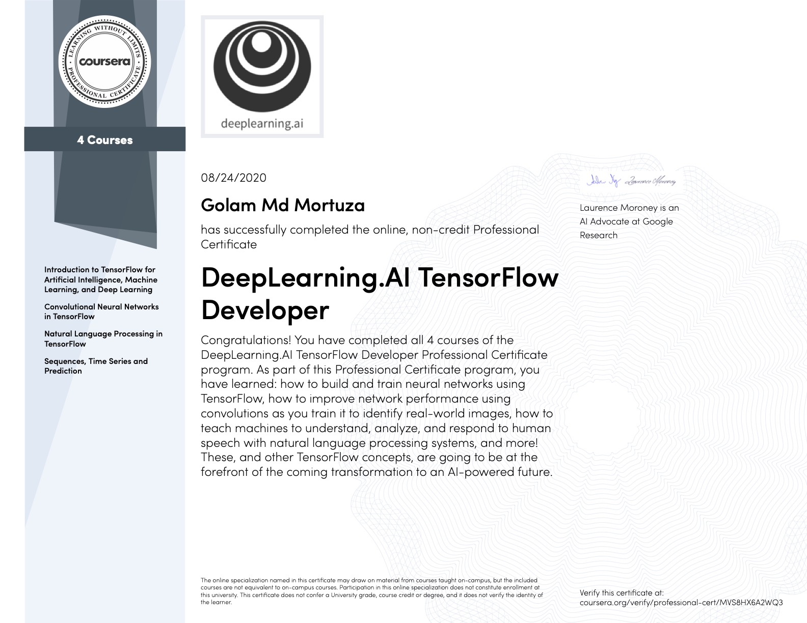

# Tensorflow Specialization offered by deeplearning.ai at Coursera 

## 1. Introduction to TensorFlow for Artificial Intelligence, Machine Learning, and Deep Learning

### Quizes
    
 - [Week 1](1.%20Introduction%20to%20TensorFlow%20for%20Artificial%20Intelligence%2C%20Machine%20Learning%2C%20and%20Deep%20Learning/Week%201/Quiz.md)
 - [Week 2](1.%20Introduction%20to%20TensorFlow%20for%20Artificial%20Intelligence%2C%20Machine%20Learning%2C%20and%20Deep%20Learning/Week%202/Quiz.md)
 - [Week 3](1.%20Introduction%20to%20TensorFlow%20for%20Artificial%20Intelligence%2C%20Machine%20Learning%2C%20and%20Deep%20Learning/Week%203/Quiz.md)
 - [Week 4](1.%20Introduction%20to%20TensorFlow%20for%20Artificial%20Intelligence%2C%20Machine%20Learning%2C%20and%20Deep%20Learning/Week%204/Quiz.md)

### Programming assignment

 - [Week 1](1.%20Introduction%20to%20TensorFlow%20for%20Artificial%20Intelligence%2C%20Machine%20Learning%2C%20and%20Deep%20Learning/Week%201/Programming%20assignment/Excercise1.ipynb)
 - [Week 2](1.%20Introduction%20to%20TensorFlow%20for%20Artificial%20Intelligence%2C%20Machine%20Learning%2C%20and%20Deep%20Learning/Week%202/Programming%20assignment/Excercise2.ipynb)
 - [Week 3](1.%20Introduction%20to%20TensorFlow%20for%20Artificial%20Intelligence%2C%20Machine%20Learning%2C%20and%20Deep%20Learning/Week%203/Programming%20assignment/Excercise3.ipynb)
 - [Week 4](1.%20Introduction%20to%20TensorFlow%20for%20Artificial%20Intelligence%2C%20Machine%20Learning%2C%20and%20Deep%20Learning/Week%204/Programming%20assignment/Excercise4.ipynb)

### Resources

 - [Week 1](1.%20Introduction%20to%20TensorFlow%20for%20Artificial%20Intelligence%2C%20Machine%20Learning%2C%20and%20Deep%20Learning/Week%201/Resources/resources.md) --> Getting started, Hello world
 - [Week 2](1.%20Introduction%20to%20TensorFlow%20for%20Artificial%20Intelligence%2C%20Machine%20Learning%2C%20and%20Deep%20Learning/Week%202/Resources/resources.md) --> Callbacks, on_epoch_end
 - [Week 3](1.%20Introduction%20to%20TensorFlow%20for%20Artificial%20Intelligence%2C%20Machine%20Learning%2C%20and%20Deep%20Learning/Week%203/Resources/resources.md) --> ConvNet, Pooling, MNIST fashion
 - [Week 2](1.%20Introduction%20to%20TensorFlow%20for%20Artificial%20Intelligence%2C%20Machine%20Learning%2C%20and%20Deep%20Learning/Week%204/Resources/resources.md) --> ImageGenerator, fit_generator, CompactImage

## 2. Convolutional Neural Networks in TensorFlow
 
### Quizes

 - [Week 1](https://github.com/gmortuza/tensorflow_specialization/blob/master/2.%20Convolutional%20Neural%20Networks%20in%20TensorFlow/Week%201/Quiz.md)
 - [Week 2](https://github.com/gmortuza/tensorflow_specialization/blob/master/2.%20Convolutional%20Neural%20Networks%20in%20TensorFlow/Week%202/Quiz.md)
 - [Week 3](https://github.com/gmortuza/tensorflow_specialization/blob/master/2.%20Convolutional%20Neural%20Networks%20in%20TensorFlow/Week%203/Quiz.md)
 - [Week 4](https://github.com/gmortuza/tensorflow_specialization/blob/master/2.%20Convolutional%20Neural%20Networks%20in%20TensorFlow/Week%204/Quiz.md)

### Programming assignment

 - [Week 1](https://github.com/gmortuza/tensorflow_specialization/blob/master/2.%20Convolutional%20Neural%20Networks%20in%20TensorFlow/Week%201/Programming%20assignment/Excercise_1_Cats_vs_Dogs.ipynb)
 - [Week 2](https://github.com/gmortuza/tensorflow_specialization/blob/master/2.%20Convolutional%20Neural%20Networks%20in%20TensorFlow/Week%202/Programming%20assignment/Excercise_2_Cats_vs_Dogs_image_augmentation.ipynb)
 - [Week 3](https://github.com/gmortuza/tensorflow_specialization/blob/master/2.%20Convolutional%20Neural%20Networks%20in%20TensorFlow/Week%203/Programming%20assignment/Excercise_3_Horse_vs_human_transfer_learning.ipynb)
 - [Week 4](https://github.com/gmortuza/tensorflow_specialization/blob/master/2.%20Convolutional%20Neural%20Networks%20in%20TensorFlow/Week%204/Programming%20assignment/Excercise_4_multi_class_classifier.ipynb)

### Resources

 - [Week 1](https://github.com/gmortuza/tensorflow_specialization/blob/master/2.%20Convolutional%20Neural%20Networks%20in%20TensorFlow/Week%201/Resources/resources.md)
 - [Week 2](https://github.com/gmortuza/tensorflow_specialization/blob/master/2.%20Convolutional%20Neural%20Networks%20in%20TensorFlow/Week%202/Resources/resources.md)
 - [Week 3](https://github.com/gmortuza/tensorflow_specialization/blob/master/2.%20Convolutional%20Neural%20Networks%20in%20TensorFlow/Week%203/Resources/resources.md)
 - [Week 4](https://github.com/gmortuza/tensorflow_specialization/blob/master/2.%20Convolutional%20Neural%20Networks%20in%20TensorFlow/Week%204/Resources/resources.md)

## [3. Natural Language Processing in TensorFlow](https://github.com/gmortuza/tensorflow_specialization/tree/master/3.%20Natural%20Language%20Processing%20in%20TensorFlow)

### Quizes
 - [Week 1](https://github.com/gmortuza/tensorflow_specialization/blob/master/3.%20Natural%20Language%20Processing%20in%20TensorFlow/Week%201/Quiz.md)
 - [Week 2](https://github.com/gmortuza/tensorflow_specialization/blob/master/3.%20Natural%20Language%20Processing%20in%20TensorFlow/Week%202/Quiz.md)
 - [Week 3](https://github.com/gmortuza/tensorflow_specialization/blob/master/3.%20Natural%20Language%20Processing%20in%20TensorFlow/Week%203/Quiz.md)
 - [Week 4](https://github.com/gmortuza/tensorflow_specialization/blob/master/3.%20Natural%20Language%20Processing%20in%20TensorFlow/Week%204/Quiz.md)

### Programming assignment

 - [Week 1](https://github.com/gmortuza/tensorflow_specialization/blob/master/3.%20Natural%20Language%20Processing%20in%20TensorFlow/Week%201/Programming%20assignment/Course_3_Week_1_Exercise_question.ipynb)
 - [Week 2](https://github.com/gmortuza/tensorflow_specialization/blob/master/3.%20Natural%20Language%20Processing%20in%20TensorFlow/Week%202/Programming%20assignment/Course_3_Week_2_Exercise_Answer.ipynb)
 - [Week 3](https://github.com/gmortuza/tensorflow_specialization/blob/master/3.%20Natural%20Language%20Processing%20in%20TensorFlow/Week%203/Programming%20assignment/NLP_Course_Week_3_Exercise_Question.ipynb)
 - [Week 4](https://github.com/gmortuza/tensorflow_specialization/blob/master/3.%20Natural%20Language%20Processing%20in%20TensorFlow/Week%204/Programming%20assignment/NLP_Week4_Exercise_Shakespeare_Question.ipynb)

### Resources

 - [Week 1](https://github.com/gmortuza/tensorflow_specialization/blob/master/3.%20Natural%20Language%20Processing%20in%20TensorFlow/Week%201/Resources/resources.md) --> Tokenizer, pad sequences
 - [Week 2](https://github.com/gmortuza/tensorflow_specialization/blob/master/3.%20Natural%20Language%20Processing%20in%20TensorFlow/Week%202/Resources/resources.md) --> Word Embedding
 - [Week 3](https://github.com/gmortuza/tensorflow_specialization/blob/master/3.%20Natural%20Language%20Processing%20in%20TensorFlow/Week%203/Resources/resources.md) --> Sentiment classifier
 - [Week 4](https://github.com/gmortuza/tensorflow_specialization/blob/master/3.%20Natural%20Language%20Processing%20in%20TensorFlow/Week%204/Resources/resources.md) --> Poetry generator

## [4. Sequences, Time Series and Prediction](https://github.com/gmortuza/tensorflow_specialization/tree/master/4.%20Sequences%2C%20Time%20Series%20and%20Prediction)

### Quizes
 - [Week 1](https://github.com/gmortuza/tensorflow_specialization/blob/master/4.%20Sequences%2C%20Time%20Series%20and%20Prediction/Week%201/Quiz.md)
 - [Week 2](https://github.com/gmortuza/tensorflow_specialization/blob/master/4.%20Sequences%2C%20Time%20Series%20and%20Prediction/Week%202/Quiz.md)
 - [Week 3](https://github.com/gmortuza/tensorflow_specialization/blob/master/4.%20Sequences%2C%20Time%20Series%20and%20Prediction/Week%203/Quiz.md)
 - [Week 4](https://github.com/gmortuza/tensorflow_specialization/blob/master/4.%20Sequences%2C%20Time%20Series%20and%20Prediction/Week%204/Quiz.md)

### Programming assignment

 - [Week 1](https://github.com/gmortuza/tensorflow_specialization/blob/master/4.%20Sequences%2C%20Time%20Series%20and%20Prediction/Week%201/Programming%20assignment/Week_1_Exercise_Question.ipynb)
 - [Week 2](https://github.com/gmortuza/tensorflow_specialization/blob/master/4.%20Sequences%2C%20Time%20Series%20and%20Prediction/Week%202/Programming%20assignment/S%2BP_Week_2_Exercise_Question.ipynb)
 - [Week 3](https://github.com/gmortuza/tensorflow_specialization/blob/master/4.%20Sequences%2C%20Time%20Series%20and%20Prediction/Week%203/Programming%20assignment/S%2BP_Week_3_Exercise_Question.ipynb)
 - [Week 4](https://github.com/gmortuza/tensorflow_specialization/blob/master/4.%20Sequences%2C%20Time%20Series%20and%20Prediction/Week%204/Programming%20assignment/S%2BP_Week_4_Exercise_Question.ipynb)

### Resources

 - [Week 1](https://github.com/gmortuza/tensorflow_specialization/blob/master/4.%20Sequences%2C%20Time%20Series%20and%20Prediction/Week%201/Resources/resources.md)
 - [Week 2](https://github.com/gmortuza/tensorflow_specialization/blob/master/4.%20Sequences%2C%20Time%20Series%20and%20Prediction/Week%202/Resources/resources.md)
 - [Week 3](https://github.com/gmortuza/tensorflow_specialization/blob/master/4.%20Sequences%2C%20Time%20Series%20and%20Prediction/Week%203/Resources/resources.md)
 - [Week 4](https://github.com/gmortuza/tensorflow_specialization/blob/master/4.%20Sequences%2C%20Time%20Series%20and%20Prediction/Week%204/Resources/resources.md)
 
 
